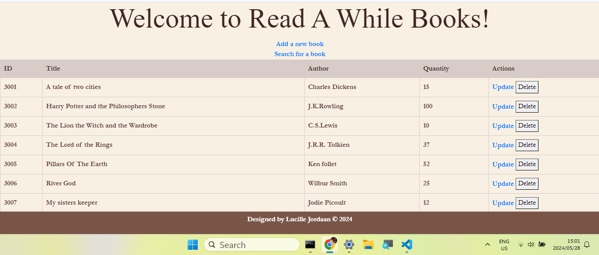

# Flask-Book-store-app

# Read-A-While Book Manager

This project is a Flask application based on the original Python program that uses SQLite to manage a database of books. The original program was adapted and extended to create an interactive web application for managing books. Below are the modifications made to the original code:

- Integration of Flask framework to create a web application.
- Implementation of HTML templates for user interface.
- Addition of routes for adding, updating, searching, and deleting books.
- Styling using CSS to enhance the user interface.

## Modifications
- Converted the original program into a Flask application.
- Created HTML templates for rendering pages.
- Implemented routes for CRUD operations on the book database.
- Added CSS styling for improved user interface.

## Usage
To run the Flask application locally:
1. Install the required dependencies using `pip install -r requirements.txt`.
2. Run the Flask application using `python app.py`.
3. Access the application in your web browser at `http://localhost:5000`.

## Deployment
The application can be deployed on GitHub Pages or any other hosting service for web applications.

